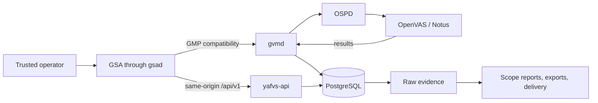

<!-- SPDX-FileCopyrightText: 2026 Robert Pelfrey <Robert@Pelfrey.de> -->
<!-- SPDX-License-Identifier: GPL-3.0-or-later -->

# YAFVS

**Yet Another Fine Vulnerability Scanner**

YAFVS (pronounced “yaff-vis”) is an opinionated, OpenVAS-derived vulnerability
scanner for trusted scanner operators. It combines guarded evidence collection,
scope-based reporting, and an incremental native HTTP/JSON API direction in one
provenance-preserving monorepo. It is intentionally not an OpenVAS-compatible
drop-in replacement.

YAFVS is alpha-stage source, not a finished distribution. The development
runtime and operator workflows are real and tested, but there is no binary or
container release, hosted service, production deployment promise, feed mirror,
support promise, or feed redistribution.

## What Exists Today

| Surface | Maturity | What that means |
| --- | --- | --- |
| Source, build, and assurance tooling | Implemented | The monorepo has component inventory, dependency/build commands, license checks, and a source quality gate. |
| Operator workflows | Development-validated | Target/task, raw-report, scope-report, export, and browser workflows run in the guarded development stack. |
| Docker application runtime | Experimental | Persistent local development services exist; they are not a production deployment profile. |
| Native HTTP/JSON API | In migration | DB-backed native reads and guarded writes exist while GMP/XML remains compatibility and control plumbing. |
| Rust operator CLI | Incremental migration | Rust implements 70 parity-tested subcommands across repository, assurance, runtime-inspection, guarded resource/task control, immutable feed staging, and explicit opt-in operator actions; Python remains the compatibility entrypoint for the rest. |
| Production and distribution | Not available | Authentication, TLS, deployment, packaging, hosted-service, and non-source release gates remain separate unfinished work. |

## System Shape



Targets and tasks control technical evidence collection. Raw reports preserve
what the scanner observed; scope reports are analytical views over completed
evidence and retain source provenance. See
[Architecture Flows](docs/ARCHITECTURE_FLOWS.md) for the detailed compatibility,
native API, scan, feed, and reporting paths.

## Ten-Minute Source Evaluation

This path evaluates the checkout and its deterministic tooling. It does not
download feeds, start containers, run a scan, or pretend to be a production
installation.

Prerequisites are Git, Rust/Cargo, Python 3.11 or newer, and `just`. The
golden-path repository and inventory checks run through the Rust CLI, while
remaining commands continue through the Python compatibility entrypoint.
Docker, compiler, Node, and component dependencies are reported by `doctor`
and are needed for deeper build/runtime work.

```sh
git clone https://github.com/TheTurboForge/YAFVS.git
cd YAFVS
just status --json
just inventory --json
just doctor --status-only --json
just license-report --status-only --json
```

On a clean checkout, `status` should report the repository clean, `inventory`
should find all ten expected imported components, and `license-report` should
pass. `doctor` should complete with structured findings; the current alpha
reports explicit deferred-surface warnings even on a prepared host, while
missing-tool failures are the supported setup gap list rather than an
invitation to guess.

The explicit Rust entrypoint exposes the complete migrated command surface:

```sh
just yafvsctl-rust --help
just yafvsctl-rust status --json
just yafvsctl-rust doctor --status-only --json
```

A full build, feed initialization, application startup, and browser workflow
take longer and have meaningful state and security boundaries. Continue with
[Building YAFVS](BUILDING.md), the
[runtime guide](docker/runtime/README.md), and the
[CLI reference](docs/CLI_REFERENCE.md).

## Operator And Security Boundary

YAFVS deliberately removed inherited product RBAC. This is an intentional
trust-boundary decision, not a missing feature: one installation represents one
trusted scanner-operator team, whose individually authenticated members share
visibility and authority so they can continue one another's work and provide
cover during leave or other absences. Asset count does not make an installation
multi-tenant. People who only consume findings for remediation, compliance,
management, or reporting should receive controlled reports, exports,
notifications, or delivery artifacts rather than console accounts.

Where administrative or confidentiality boundaries require hard tenant
isolation, deploy separate, independently operated stacks with separate data,
secrets, scanner execution, network reachability, and operational state.
In-application resource permissions are not a substitute for that deployment
boundary. See the [operator access model](docs/USER_MANUAL.md#operator-access-and-security-boundary)
and [trust boundaries](docs/TRUST_BOUNDARIES.md#operator-console-access).

The local development credentials are `admin` / `admin`; they are not
production guidance. Login exposure, TLS, host access, backups, auditability,
credential handling, and deployment controls define the production boundary.
Scan helpers ship no target: the full-test path requires one explicit canonical
CIDR, rejects more than 256 addresses, and requires a matching target-bound
confirmation before start.

## Engineering Direction

New security-sensitive backend and product infrastructure is Rust-first.
Python remains appropriate for build, Docker, browser, and subprocess
orchestration, while retained inherited C is hardened and tested until a
validated replacement is justified. The native API is being built as typed
product contracts over PostgreSQL, not as a thin REST wrapper around GMP/XML.
The [product-direction roadmap](docs/ROADMAP.md) connects that engineering
direction to the vulnerability-management outcomes YAFVS is intended to
support.

## Documentation Map

| Need | Document |
| --- | --- |
| Product direction and intended outcomes | [Product Direction Roadmap](docs/ROADMAP.md) |
| Vulnerability-management operating model | [Vulnerability Management Practice](docs/VULNERABILITY_MANAGEMENT_PRACTICE.md) |
| Commands and safety semantics | [CLI Reference](docs/CLI_REFERENCE.md) |
| Build and dependency baseline | [Building YAFVS](BUILDING.md) |
| Development runtime | [Docker Runtime](docker/runtime/README.md) |
| Operator behavior | [User Manual](docs/USER_MANUAL.md) |
| Data and service flows | [Architecture Flows](docs/ARCHITECTURE_FLOWS.md) |
| Native API contract and schema | [API Contract](docs/API_CONTRACT.md) and [OpenAPI](api/openapi/yafvs-v1.yaml) |
| Validation expectations | [Validation Standards](docs/VALIDATION_STANDARDS.md) |
| Production and publication limits | [Production Posture](docs/PRODUCTION_POSTURE.md) and [Public Release Readiness](docs/PUBLIC_RELEASE_READINESS.md) |
| Memory-safety direction | [Memory Safety](docs/MEMORY_SAFETY.md) and [C Hardening](docs/C_HARDENING.md) |
| Intentional upstream divergence | [Changes From Upstream](docs/CHANGES_FROM_UPSTREAM.md) |
| Source provenance and licensing | [Upstreams](UPSTREAMS.md) and [License Audit](LICENSE_AUDIT.md) |

## Name And Identity

YAFVS stands for **Yet Another Fine Vulnerability Scanner**. The name is
intentionally self-aware: vulnerability scanning is an established field, and
YAFVS builds on useful OpenVAS scanner foundations while developing its own
product identity, operating model, APIs, and architectural direction.

YAFVS was previously developed as TurboVAS. Existing Git history, historical
records, and truthful TurboVAS-era provenance remain under that name; the
rename does not rewrite them.

## Relationship To Greenbone

“OpenVAS-derived” describes source lineage, not product compatibility.
YAFVS is independent and is not affiliated with, sponsored by, or endorsed
by Greenbone AG. Greenbone remains the upstream source for the imported
components recorded in [UPSTREAMS.md](UPSTREAMS.md).

YAFVS supports Community Feed workflows only. It does not support Greenbone
Enterprise Feed subscription keys or Enterprise Feed synchronization.
Organizations seeking official Greenbone products, Enterprise Feed access,
support, or services should contact Greenbone directly.

## Contributions And Security Reports

Public source visibility is for transparency at this stage. YAFVS is not
currently seeking external contributions and does not provide a support
promise. Read [CONTRIBUTING.md](CONTRIBUTING.md) and
[SECURITY.md](SECURITY.md) before opening an issue or pull request, and never
submit secrets, scan results, customer data, or private configuration.
